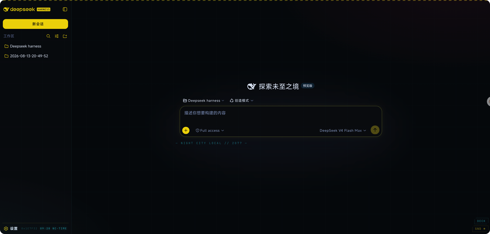

# dsh-theme-cyberpunk2077 — NIGHT CITY EDITION

Cyberpunk 2077（夜之城）风格的 DSH Web UI 主题插件。纯浏览器客户端插件，零音频资源（全部 Web Audio 实时合成）。



## 视觉

- **配色**：NC 黄 `#FCE300` / 霓虹青 `#00F0FF` / 玫红 / 近黑夜蓝底
- **切角按钮**（45° chamfer）、主按钮霓虹脉冲呼吸
- **CRT 层**：扫描线 + 城市网格 + 双色霓虹雾（可关）
- **顶部危险条纹**、详情面板 HUD 角标
- **Logo 故障动画**（红青 RGB 色散，每 5.5s）
- **开机转场**：CRT 开机线 → glitch 条纹 → NIGHT CITY 标题 → 白闪（可关）。**每个标签页会话只播第一次**——刷新/断线重连不再重播，新开标签页才会再见
- **随机 Relic 干扰**：每 40-70s 屏幕闪 1-2 帧轻微错位（可关，尊重系统减弱动效）
- **字体**：MiSans（小米，jsDelivr 按 unicode-range 分片加载）+ 本地等宽栈（代码）
- **会话 = 数据碎片**：稀有度色边（白/绿/青/紫/橙循环），激活项传奇级橙黄光
- **Kiroshi 光学锁定**：悬停会话行 → 青色扫描线扫过 + 四角瞄准括号（像义眼锁定目标）
- **警示纹（hazard tape）**：错误通知顶部红黑 45° 斜纹、DECK 面板标题青色斜纹——危险区一眼可辨
- **夜之城时钟 + 数据流**：停靠在左下角设置栏的空白右半区（`0x93E2E4 23:47 NC-TIME` 一行 HUD 读出；侧栏收起自动隐藏，小屏/减弱动效关闭）
- **目标栏 → 任务追踪器**（◈ OBJECTIVE）、统计条 HUD 读出（⟨ ⟩）
- **通知/错误 → CP 通知框**：切角 + 黄边 + 滑入发光；错误红边
- **空状态氛围文案**：— NIGHT CITY LOCAL // 2077 —

## 交互与声音

- **打字机音效**：每个键合成机械声（噪声瞬态+降频体），空格/回车更低沉（可关）
- **消息音效闭环**：发送（上行双音）/ 完成（双短音）/ 错误（故障蜂鸣）/ 通知（高频双音）（可关）
- **生成中 = 战斗状态**：`PROCESSING_` 下方出现体力条式脉冲进度；每 6s 轮换一条夜之城风格「加载提示」；标签页标题切换为 `▶ NC-JOB //`
- **俚语状态条**（顶部中央）：发送 `GIG UP // 单子已发` / 完成 `PREEM. // 任务完成`（绿）/ 错误 `FLATLINE // 连接中断`（红）
- **EXECUTE ⏎ 悬停提示** + 主发送键悬停红青 RGB 分离故障
- **标签页接管**：favicon 黄色切角方块 + 标题 `DSH // NC-TERMINAL`（偶发错字闪烁）
- **性能护栏**：小屏（≤768px）自动关闭扫描线/数据流/重动画；`prefers-reduced-motion` 停掉全部循环动画

## 控制面板

右下角 `DECK` 按钮：CRT 扫描线 / Relic 干扰 / 开机转场 / 打字音效 / 消息提示音，各自独立开关，存 localStorage。`SND` 按钮一键静音全部。

## 彩蛋

- 输入框输入 `relic` 并发送 → 「WAKE UP, SAMURAI. WE HAVE A CITY TO BURN.」全屏故障时刻
- 输入框输入 `johnny` 并发送 → 强尼·银手夺屏 2.6s：全屏去饱和 + 红青色散 + 画面撕裂 + 随机台词（中英双语）+ 低频嗡鸣（尊重减弱动效）

## 文件

- `package.json` — `dsh.client`（platform: web）
- `lib/index.js` — 空宿主端
- `lib/client.js` — 浏览器 bundle（主题 + 全部子系统）

## 接线

安装：

```bash
dsh plugin --profile web add dsh-theme-cyberpunk2077
```

`~/.dsh/profiles/web/cordis.patch.yml`：

```yaml
- insert:
    - id: ui-theme-cyberpunk
      name: 'dsh-theme-cyberpunk2077'
```

插件集变更需重启 `dsh web`；bundle 内容变更加载即生效。
